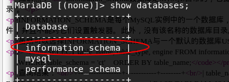
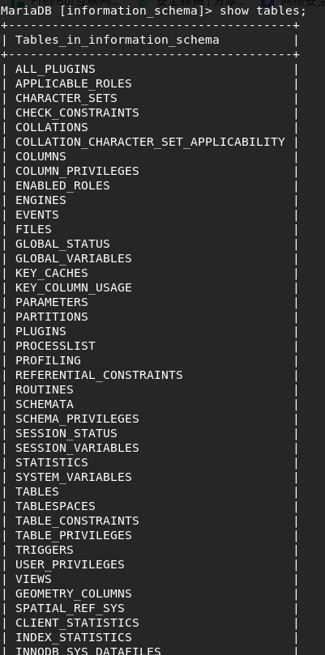
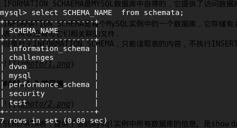
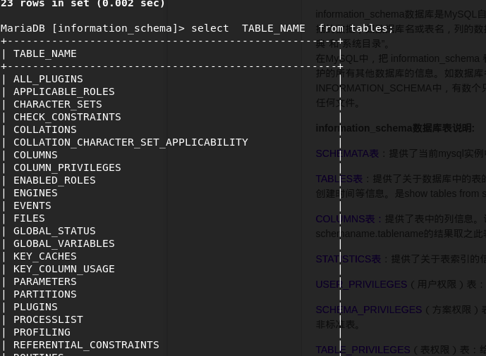
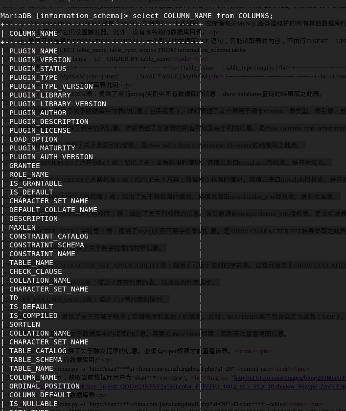
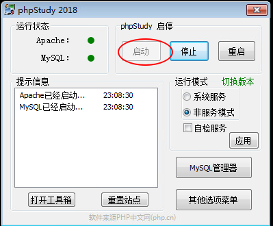
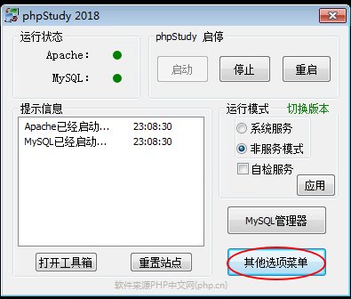
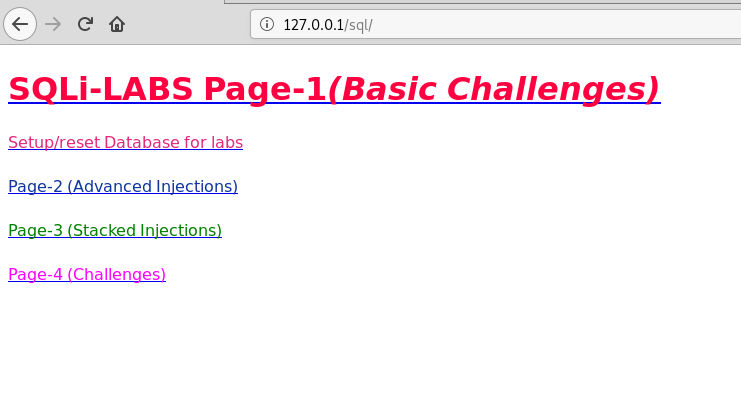
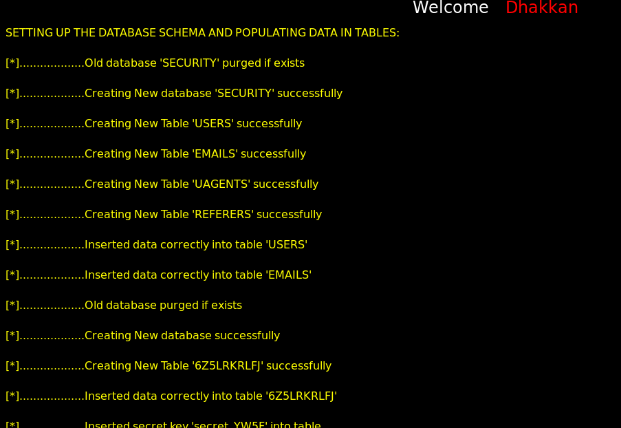

<!--
author: maomao
date: 2019-01-21
title: 2.1 SQL注入基础篇
category: web安全入门
status: publish
summary:ql注入漏洞是web层面最高危的漏洞之一。2008年至2018年期间，sql注入漏洞连续三年位于owasp漏洞排行榜中的第一名。
-->

#第二章　原理篇

##第一节：sql注入基础

##1.1 前言

从本节开始，讲开始第二章web漏洞原理篇的讲解。首先带给大家的是sql注入漏洞。sql注入漏洞是web层面最高危的漏洞之一。2008年至2018年期间，sql注入漏洞连续三年位于owasp漏洞排行榜中的第一名。
##1.2　免责声明

该课程中涉及的技术只适合于CTF比赛和有合法授权的渗透测试。请勿用于其他非法用途，如果作于其他非法用途，与本文作者无关。

##1.3什么是sql注入

在上节的课程中，已经带领大家学习了基本的sql语句使用。sql注入简单的来说，就是普通用户在web界面可以通过某些操作来执行用户输入的恶意的sql语句以达到攻击的目的。

##1.4 INFORMATION_SCHAEMA

mysql数据库注入大概是以5.0版本为分界线。5.0以下的版本是没有INFORMATION_SCHAEMA这个系统表，只能通过暴力去跑表名，而5.0以上的版本可以通过查询INFORMATION_SCHAEMA这个表来获取数据库的相关信息。关于mysql数据库，在关于mysql的注入中，发现一个注入点以后，大多数的操作都是查询INFORMATION_SCHAEMA这个表中的相关信息。

###1.4.1 简介

INFORMATION_SCHAEMA是MYSQL数据库中自带的，它提供了访问数据库元数据数据的方式。元数据库即数据的数据，如数据库的库名或者表名、列的数据类型或者访问权限等。

INFORMATION_SCHEMA是每个MySQL实例中的一个数据库，它存储有关MySQL服务器维护的所有其他数据库的信息。该 INFORMATION_SCHEMA数据库包含几个只读表。它们实际上是视图，而不是基表，所以没有与它们相关联的文件.
但是对于INFORMATION_SCHEMA，只能读取表的内容，不执行INSERT， UPDATE或DELETE对他们的操作。

###1.4.2 常用表

SCHEMATA表：提供了当前mysql实例中所有数据库的信息。是show databases的结果取之此表。

TABLES表：提供了关于数据库中的表的信息（包括视图）。详细表述了某个表属于哪个schema，表类型，表引擎，创建时间等信息。是show tables from schemaname的结果取之此表。

COLUMNS表：提供了表中的列信息。详细表述了某张表的所有列以及每个列的信息。是show columns from schemaname.tablename的结果取之此表。

这几个在日后sql注入的过程会经常用到，其他的不在此做详细的介绍，如果想要了解更多：http://help.wopus.org/mysql-manage/607.html

##1.5 搭建一个sql注入的靶场

靶场推荐使用sqli-labs。靶场下载地址：https://github.com/Audi-1/sqli-labs

###1.5.1　window平台搭建

1.推荐使用集成环境搭建，我将使用phpstudy进行安装。下载地址：http://down.php.cn/PhpStudy20180211.zip

2.下载以后打开压缩包,解压缩。然后点击phpStudySetup进行安装。这里我将其安装到了c盘下。

3.安装完成以后，运行软件。然后点击启动。

4.下载靶场文件

5.点击其他选项菜单，然后选择网站根目录,讲刚刚的下载的文件解压缩后放入里面

6.将解压缩后的文件重命名为sql

7.进入sql文件夹，找到名为sql-connections的文件夹。然后进入,找到文件db-creds.inc

7.修改“$dbpass = ''" 为 “$dbpass='root'” 

8.保存文件，然后在浏览器输入：127.0.0.1/sql访问即可。

9.点击第二个。

10.当出现如下字样说明安装成功。

###1.5.2 linux平台搭建

首先声明一点，linux 平台的mysql还有php版本不要太高。否则将会安装不成功。这里我将采用apache2+mysql+php的环境，至于环境的安装再次不过多叙述。

>1.cd  /var/www/html/

>2 .wget   wget https://codeload.github.com/Audi-1/sqli-labs/zip/master

>3.mv master master.zip

>4.unzip master.zip

>5.cd sqli-labs-master/

>6.cd sql-connections/

>7.vi db-creds.inc

>8.将红圈处改为刚刚配置数据库时设置的密码。

>9.保存退出。

>10.cd /var/www/html/

>11.mv sqli-labs-master/ sql 

>12.然后在浏览器访问 :ip/sql　

注意事项：

1.安装完成以后如果访问失败，可以尝试重启apache

>service apache2 restart 

2.重启apache还是不可以的话，可以尝试关闭系统防火墙做测试。如果可以的话，打开指定的端口即可。

3.不建议坐在公网服务器上，最好本地搭建。如果坐在公网服务器，建议坐在docker里面。

###1.5.3　靶场地址

如果大家没有时间搭建靶场的话，可以使用玄魂工作室提供的靶场：http://39.98.88.18:8080/sql/

###1.6  课后习题

本章节讲解的是基础知识，所以没有实战的ctf题目供大家玩耍。如果大家没有mysql数据库可以玩耍的话，可以使用我们上次课程那个库。题目地址是

> http://39.98.88.18/challenges#MYSQL%E5%9F%BA%E7%A1%80

从下节课开始，我们讲开始讲解sql注入。在正式开始课程之前,希望大家能够思考几个问题，我将会在下节课程中给出答案。

>1.sql注入的最终目的是什么

>2.我们如何才能够实现这个最终目的。
